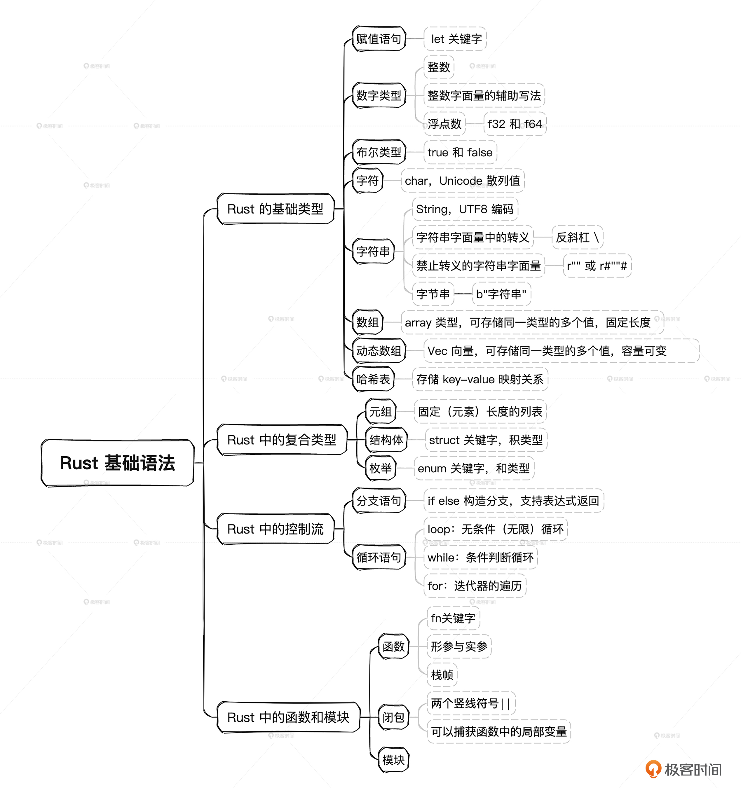

## Package Manager

### kit

| 命令        | 用途                                                                                 | 举例                                                                       |
| ----------- | ------------------------------------------------------------------------------------ | -------------------------------------------------------------------------- |
| cargo       | Rust 的包管理器，构建工具和依赖解决器。可以使用 cargo 命令创建、编辑和构建 Rust 项目 | `cargo new --bin my_project` 可以创建一个名为 my_project 的新的 Rust 项目  |
| rustup      | 用来升级维护 Rust 编译器套件的版本，同时支持维护多个版本，并可用来安装 Rust 组件     | `rustup update stable` 可将 Rust stable 版本升级至最新                     |
| rust-fmt    | 可用来对 Rust 代码按配置格式进行自动排版，用来统一 Rust 代码风格                     | 配合 cargo，直接在工程目录下运行 `cargo fmt` 就可以对整个工程进行排版      |
| rust-clippy | 可用来对 Rust 代码进行严谨性检查，指出一些写得不规范的地方                           | 配合 cargo，直接在工程目录下运行 `cargo clippy` 就可以对整个工程进行检查了 |

### Building and Running

- We can create a project using `cargo new`.
- We can build a project using `cargo build`.
- We can build and run a project in one step using `cargo run`.
- We can build a project without producing a binary to check for errors using `cargo check`.

## Data types



### Int

| 长度    | 有符号 | 无符号 |
| :------ | :----- | :----- |
| 8-bit   | i8     | u8     |
| 16-bit  | i16    | u16    |
| 32-bit  | i32    | u32    |
| 64-bit  | i64    | u64    |
| 128-bit | i128   | u128   |
| arch    | isize  | usize  |

### String

String 内部存储的是**Unicode**字符串的**UTF8**编码，而 Char 直接存的是**Unicode Scalar Value**，也就是说 String 不是 Char 的数组。

#### 与 Golang String 的区别

Go 可以直接用索引 s[i] 直接访问字节。Rust 不允许直接用索引访问字符（除非使用 .as_bytes()[i]）

```rust
let hello = String::from("你好");
let a = hello[0]; // Direct Indexing Error
```

## 特殊的循环遍历语句

```rust
fn main() {
    // 左闭右开区间
    for number in 1..4 {
        println!("{number}");
    }
    println!("--");
    // 左闭右闭区间
    for number in 1..=4 {
        println!("{number}");
    }
    println!("--");
    // 反向
    for number in (1..4).rev() {
        println!("{number}");
    }
}
// 输出
1
2
3
--
1
2
3
4
--
3
2
1

```

## Closure

闭包是另一种风格的函数。它使用两个竖线符号 `||` 定义，而不是用 `fn ()` 来定义。你可以看下面的形式对比。

```rust
// 标准的函数定义
fn  add_one_v1   (x: u32) -> u32 { x + 1 }
// 闭包的定义，请注意形式对比
let add_one_v2 = |x: u32| -> u32 { x + 1 };
// 闭包的定义2，省略了类型标注
let add_one_v3 = |x|             { x + 1 };
// 闭包的定义3，花括号也省略了
let add_one_v4 = |x|               x + 1  ;

```

## 模块风格

### 目录平级风格（Directory-based Flat Style）

```plain
// 目录结构
src/
├── lib.rs
├── network.rs
├── network/
│   └── server.rs
└── client.rs
```

Rust 2018 版本引入的新风格，官方推荐。

### 功能导向风格（Feature-oriented Style）

```plain
// 目录结构
src/
├── lib.rs
├── auth/
│   ├── mod.rs
│   ├── models.rs
│   └── controllers.rs
└── products/
    ├── mod.rs
    ├── models.rs
    └── controllers.rs
```

- 适合微服务或领域驱动设计
- 相关功能集中在一起
