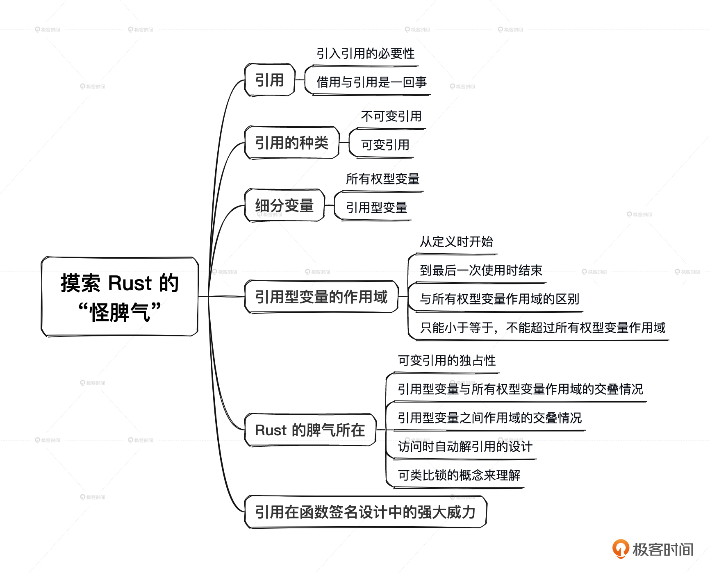

## Variables and Mutability

如果你想让这个变量的可变性暴露出来的时候，就在变量名前面明确地加个 `mut` 修饰符。
```rust
let mut x = 10u32;
```

固定尺寸类型的数据默认会在栈上；而其他复杂类型的数据默认会创建在堆上，成为堆的一个资源，然后在使用栈上的一个局部变量引用它。
```rust
fn main() {
    let s1 = String::from("I am a superman.");
    let s2 = s1;
    println!("{s1}"); // error: s1 was moved to s2, so s1 can no longer be used.
    println!("{s2}");
}
```
上面的案例会出现`borrow of moved value: s1`编译错误，Rust虽然也是把字符串的引用由 s1 拷贝到了 s2，但是只保留了最新的 s2 到字符串的指向，同时却把 s1 到字符串的指向给“抹去”了。s1 之后都处于一种“不可用”的状态，直到函数结束。

"consider cloning the value if the performance cost is acceptable." e.g. `s1.clone()`

## Ownership Rules

1. Each value in Rust has an owner.
2. There can only be one owner at a time.
3. When the owner goes out of scope, the value will be dropped.

### Transfer Ownership 
通过`->`将函数里的变量的所有权转移出来。
```rust
fn foo(s: String) -> String {
    println!("{s}");
    s
}
fn main() {
    let s1 = String::from("I am a superman.");
    let s1 = foo(s1);
    println!("{s1}");
}
```

### 拥有`Copy trait`数据的类型
- 所有整数类型: u32
- 布尔类型: bool
- 浮点类型: f32
- 字符类型: char
- 元组类型。元组里所有元素类型都实现了`Copy trait`
- 数组。数组中的元素类型实现了`Copy trait`
- 不可变的引用类型

**其他类型默认都是做移动所有权的操作。**

> 📢注意：所有权可以被转移，一旦所有权被转移，原来持有该资源的变量就失效了。变量的作用域是在最近的花括号位置内。

## References and Borrowing

### 一个所有权型变量的可变引用与不可变引用的作用域不能交叠

**引用型变量的作用域是从它定义起到它最后一次使用时结束。** 比如下面代码中的所有权`a`变量，作用域是2~8行；不可变引用`c`的作用域是3行，可变应用`b`的作用域是4~7行。
```rust
fn main() {
    let mut a = 10u32;
    let c = &a;
    let b = &mut a;
    *b = 20;
    println!("{c}");
}
// error[E0502]: cannot borrow `a` as mutable because it is also borrowed as immutable
// --> src/main.rs:5:13
//   |
// 4 |     let c = &a;
//   |             -- immutable borrow occurs here
// 5 |     let b = &mut a;
//   |             ^^^^^^ mutable borrow occurs here
// 6 |     *b = 20;
// 7 |     println!("{c}");
//   |               --- immutable borrow later used here

```

### 一个所有权型变量的可变借用之间的作用域也不能交叠

```rust
fn main() {
    let mut a = 10u32;
    let b = &mut a;
    *b = 20;
    let c = &mut a; 
    *c = 30;
    println!("{b}");
}
// error[E0499]: cannot borrow `a` as mutable more than once at a time
// --> src/main.rs:5:13
//   |
// 3 |     let b = &mut a;
//   |             ------ first mutable borrow occurs here
// 4 |     *b = 20;
// 5 |     let c = &mut a; 
//   |             ^^^^^^ second mutable borrow occurs here
// 6 |     *c = 30;
// 7 |     println!("{b}");
//   |               --- first borrow later used here
```

### 有借用的情况下，不能对所有权变量进行更改值的操作
所有权变量不管是可变还是不可变。
```rust
fn main() {
    let mut a = 10u32;
    let b = &mut a;
    a = 30; // error[E0506]: cannot assign to `a` because it is borrowed
    println!("{b}");
}
```

### 一个所有权型变量的可变引用也具有所有权特征
```rust
fn main() {
    let mut a = 10u32;
    let r1 = &mut a;
    let r2 = r1;
    
    println!("{r1}");
}
// error[E0382]: borrow of moved value: `r1`
//  --> src/main.rs:6:15
//   |
// 3 |     let r1 = &mut a;
//   |         -- move occurs because `r1` has type `&mut u32`, which does not implement the `Copy` trait
// 4 |     let r2 = r1;
//   |              -- value moved here
// 5 |     
// 6 |     println!("{r1}");
//   |               ^^^^ value borrowed here after move
```

### 多级应用
```rust
fn main() {
    let mut a1 = 10u32;
    let mut b = &mut a1;
    *b = 20;
    let c = &mut b;
    *c = 30;  // expected `&mut u32`, found integer 
    // 
    // 这里的 b 是一个可变引用，不能把 &mut u32 直接赋值为 u32
    // 需要先解引用 b，然后再修改它指向的值: **c = 30
    println!("{c}")
}
```

### Maind Map

